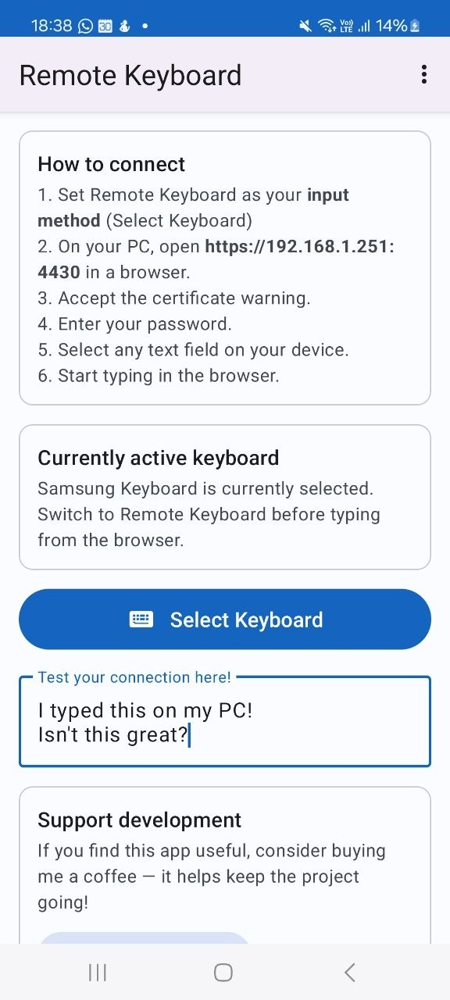
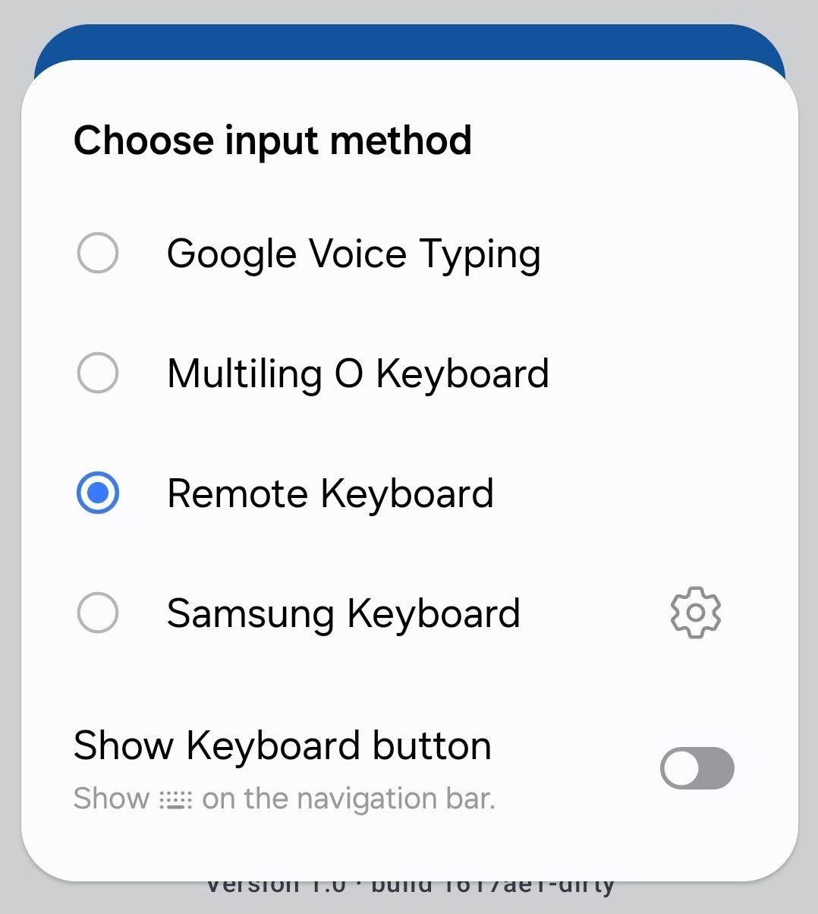

# Remote Keyboard

An Android input method that lets you type on your phone from your PC keyboard over Wi-Fi.

This is a fork of [Lepidos/remotekeyboard](https://github.com/Lepidos/remotekeyboard), which itself is a modernised fork of the original [onyxbits/remotekeyboard](https://github.com/onyxbits/remotekeyboard).

| | |
|---|---|
|  |  |

---

## How it works

The app runs a small server on your Android device. You connect from your PC, and everything you type is injected directly into whatever text field is active on the phone — chat apps, browsers, email, anything.

```
PC keyboard  →  Wi-Fi (TCP/telnet)  →  Android input method  →  active text field
```

---

## What's new compared to the original

| Feature | [onyxbits original](https://github.com/onyxbits/remotekeyboard) | This fork |
|---|---|---|
| Build system | Ant | Gradle (AGP 8.x) |
| Target SDK | Old | API 34 (Android 14) |
| Min SDK | — | API 21 (Android 5.0) |
| GitHub Actions CI | ❌ | ✅ Builds APK on every push |
| UI theme | Holo (old) | ✅ Material Design 3 (Material You) |
| Launcher icon | Old bitmap | ✅ Adaptive vector icon (keyboard) |

---

## Features

- Type from your PC keyboard into any Android text field
- Text replacement / macro system
- Home screen widget to toggle the server
- F1–F12 key support with configurable quick-launch actions

---

## Requirements

- Android 5.0 (API 21) or newer
- PC and phone on the **same Wi-Fi network**
- A telnet client on the PC (e.g. `telnet`, `netcat`, or PuTTY)

---

## Installation

### Option 1 — Download from GitHub Actions

Open the [Actions tab](../../actions), click the latest successful workflow run, and download the `app-release` artifact.

### Option 2 — Build from source (see [Building](#building))


---

## Setup (one-time)

### 1. Install the APK

Transfer `app-release.apk` to your phone and install it. You must allow installation from unknown sources:

- **Android 8+**: Settings → Apps → Special app access → Install unknown apps
- **Android 7 and older**: Settings → Security → Unknown sources

Or install via ADB:

```bash
adb install app/build/outputs/apk/debug/app-debug.apk
```

### 2. Enable the keyboard

1. Settings → **General Management → Keyboard** (or Language & Input → Virtual Keyboard)
2. Tap **Manage keyboards**
3. Enable **Remote Keyboard** and accept the warning

### 3. Activate on demand

Whenever a text field is focused, switch to Remote Keyboard:

- Tap the **keyboard icon** in the navigation bar, or
- Long-press the **space bar** on most keyboards and select **Remote Keyboard**

### 4. Set a password (recommended)

Open the Remote Keyboard app → menu → **Settings** → **Password**. Without a password anyone on your local network can connect.

---

## Usage

### On your phone

1. Tap a text field to bring up the keyboard
2. Switch to **Remote Keyboard** (see step 3 above)
3. Open the **Remote Keyboard** app — it shows your phone's Wi-Fi IP address and port (default **2323**)

### On your PC

```bash
telnet <PHONE_IP> 2323
```

Everything you type is sent to the phone in real time.  
Press **Ctrl+]** then `quit` to disconnect.

### Keyboard shortcuts

| Key | Action |
|-----|--------|
| Normal keys | Insert text at cursor |
| Backspace / Delete | Delete character |
| Arrow keys | Move cursor |
| Enter | Submit / newline |
| F1–F12 | Configurable app quick-launch |
| Ctrl+] | Disconnect (telnet) |

---

## Building

### Prerequisites

- **JDK 17** or newer (`java -version`)
- **Android SDK** with:
  - Build Tools 34.0.0
  - Platform `android-34`

#### Install Android SDK command-line tools (if needed)

```bash
# Download from https://developer.android.com/studio#command-tools
# then:
export ANDROID_HOME=~/android-sdk
sdkmanager "platform-tools" "platforms;android-34" "build-tools;34.0.0"
```

### Clone

```bash
git clone https://github.com/caco3/RemoteKeyboard.git
cd RemoteKeyboard
```

### Build debug APK

```bash
export ANDROID_HOME=~/android-sdk   # adjust to your SDK path
./gradlew assembleDebug
```

The APK is written to:

```
app/build/outputs/apk/debug/app-debug.apk
```

### Build release APK (unsigned)

```bash
./gradlew assembleRelease
```

The APK is written to:

```
app/build/outputs/apk/release/app-release-unsigned.apk
```

---

## Local deploy via ADB

With a device connected over USB (or Wi-Fi ADB), build and install in one step:

```bash
# Build + install debug build
./gradlew assembleDebug && adb install -r app/build/outputs/apk/debug/app-debug.apk
```

Or use the Gradle shortcut which builds and installs in a single task:

```bash
./gradlew installDebug
```

### Check connected devices

```bash
adb devices
```

### Launch the app immediately after install

```bash
adb shell am start -n de.caco3.remotekeyboard/.MainActivity
```

### View live logcat output

```bash
adb logcat -s RemoteKeyboard
```

---

## Security notes

- Traffic is **unencrypted** (plain TCP telnet) — only use on a trusted local network
- **Always set a password** in Settings — it is the only access-control gate besides being on the same network

---

## License

Apache 2.0 — see [LICENSE](LICENSE)

Original work © onyxbits  
Modernisation © Lepidos  
Modernisation © caco3
