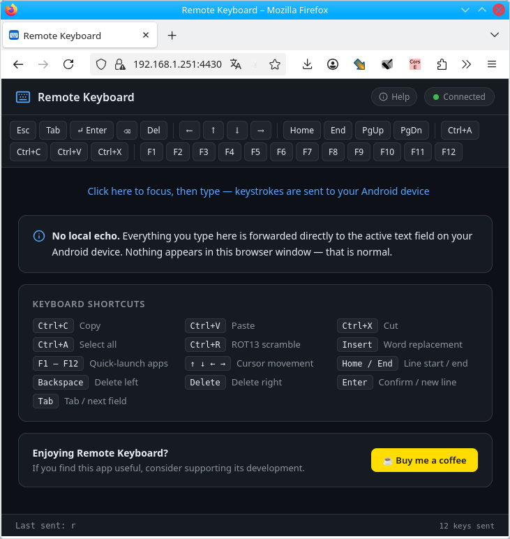

# Remote Keyboard — User Guide

## How it works

The app runs a small **HTTPS web server** on your Android device. You open the served web page from your PC browser, and everything you type is injected directly into whatever text field is active on the phone — chat apps, browsers, email, anything.

```
PC keyboard → Wi-Fi (HTTPS) → Android web server → input method (keyboard) → active text field
```

The connection uses HTTPS, thus your keystrokes are encrypted on the local network, nobody can see what you're typing. The browser will show a certificate warning on the first visit; this is normal for a local self-signed certificate and you can safely proceed.

### Screenshots

| | | |
|---|---|---|
|  |  |  |

---

---

## Requirements

- Android 7.0 (API 24) or newer
- PC and phone on the **same Wi-Fi network**
- A modern web browser on the PC (Chrome, Firefox, Edge, Safari)

---

## Installation

### Option 1 — Download from GitHub

Open the [Releases](https://github.com/caco3/remotekeyboard/releases), click the latest release, and download the `RemoteKeyboard-v0.4.0.apk` artifact.

### Option 2 — Build from source

See [Building](README.md#building) in the project README.

---

## Setup (one-time)

### 1. Install the APK

Transfer `RemoteKeyboard-v0.4.0.apk` to your phone and install it. You must allow installation from unknown sources:

- **Android 8+**: Settings → Apps → Special app access → Install unknown apps
- **Android 7 and older**: Settings → Security → Unknown sources

Or install via ADB:

```bash
adb install app/build/outputs/apk/debug/app-debug.apk
```

### 2. Enable the keyboard

1. Settings → **General Management → Keyboard** (or Language & Input → Virtual Keyboard)
2. Tap **Manage keyboards**
3. Enable **Remote Keyboard** and accept the warning

### 3. Activate on demand

Whenever a text field is focused, switch to Remote Keyboard:

- Tap the **keyboard icon** in the navigation bar, or
- Long-press the **space bar** on most keyboards and select **Remote Keyboard**

### 4. Set a password

The app will ask you to set a password on the first launch. **This is mandatory.** Without a password, anyone on your local network could connect. You can change it later in the app menu → **Settings** → **Password**.

---

## Usage

### On your phone

1. Tap a text field to bring up the keyboard
2. Switch to **Remote Keyboard** (see step 3 above)
3. Open the **Remote Keyboard** app — it shows your phone's Wi-Fi IP address and port (default **4430**)

### On your PC

1. Open your web browser
2. Navigate to **`https://<PHONE_IP>:4430`**
3. Accept the self-signed certificate warning
4. Enter your password on the login page
5. Start typing in the web page — every keystroke is sent to your phone in real time. **Nothing is echoed in the browser** — that is by design; watch your phone to see the typed text.

### On-screen toolbar

The web client has a clickable toolbar for special keys:

`Esc` `Tab` `Enter` `⌫ Backspace` `Del` · `← ↑ ↓ →` · `Home` `End` `PgUp` `PgDn` · `Ctrl+A` `Ctrl+C` `Ctrl+V` `Ctrl+X` · `F1`–`F12`

### Keyboard shortcuts

| Key | Action |
|-----|--------|
| Normal keys | Insert text at cursor |
| Backspace / Delete | Delete character |
| Arrow keys | Move cursor |
| Enter | Submit / newline |
| Home / End | Jump to line start / end |
| Tab | Tab / next field |
| Ctrl+A | Select All |
| Ctrl+C | Copy |
| Ctrl+V | Paste |
| Ctrl+X | Cut |
| Ctrl+R | ROT13 scramble selection |
| Insert | Trigger word replacement |
| F1–F12 | Configurable app quick-launch |

---

## Security notes

- Traffic is **encrypted via HTTPS** on the local network.
- **Always keep your password strong** — it is the access-control gate besides being on the same network.
- The self-signed certificate is generated locally; the browser warning is expected and safe to bypass for this local connection.

---

## Troubleshooting

| Problem | Solution |
|---------|----------|
| Browser shows "Your connection is not private" | This is expected. Click **Advanced** → **Proceed to site** (or equivalent). |
| Cannot connect to the IP | Ensure PC and phone are on the **same Wi-Fi network**. Disable VPNs temporarily. |
| Typed text does not appear on the phone | Make sure the phone text field is active and **Remote Keyboard** is the selected input method. |
| F-keys do not launch apps | Configure them first in the app menu → **Settings** → **Quicklaunchers**. |
